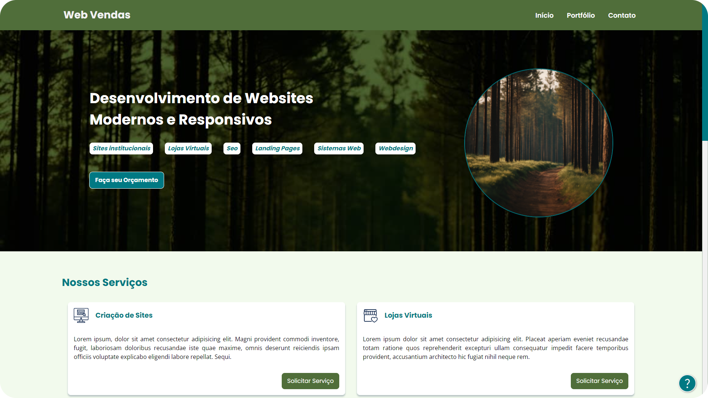

 

<h1 align="center">Projeto: Nome do Projeto</h1>

 

> Estudo de design focado em uma agência de venda de sites e serviços relacionados a área da tecnologia.

 

## Imagens do Projeto:

#### 01. Desktop:

 

<small>Imagem da versão Desktop do site.</small>

#### 02. Mobile:

 

<small>Imagem da versão mobile do site.</small>

 

## Links e Referências:

- **Link do Projeto:** [Estudo Design - Web Vendas](https://br-darkness.github.io/Estudo_Design_-_Web_Vendas/)